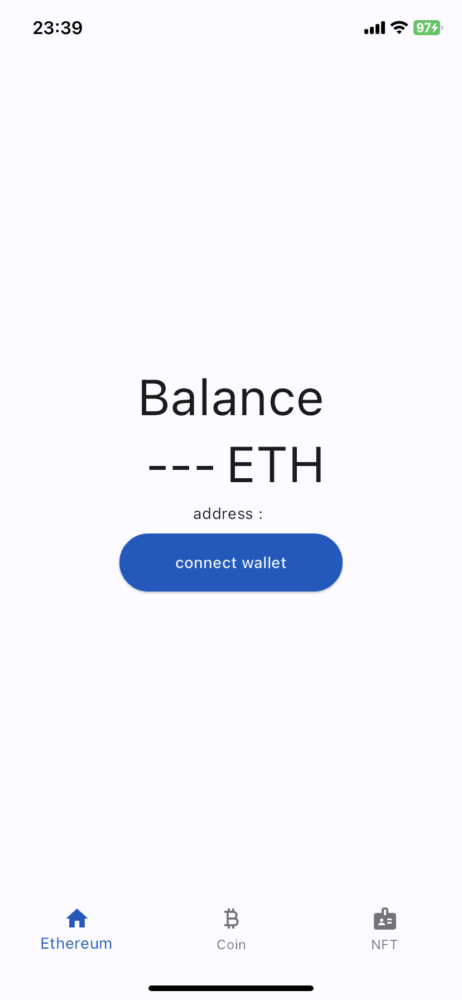
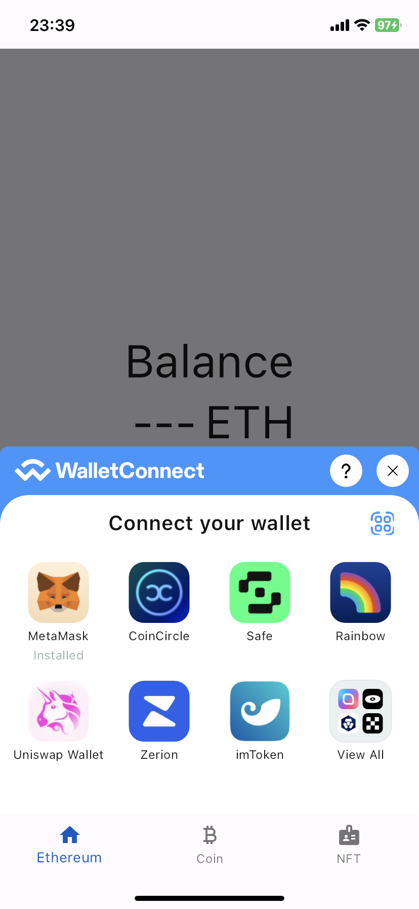
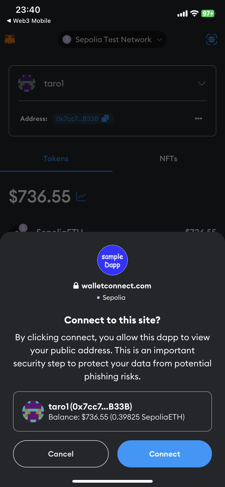
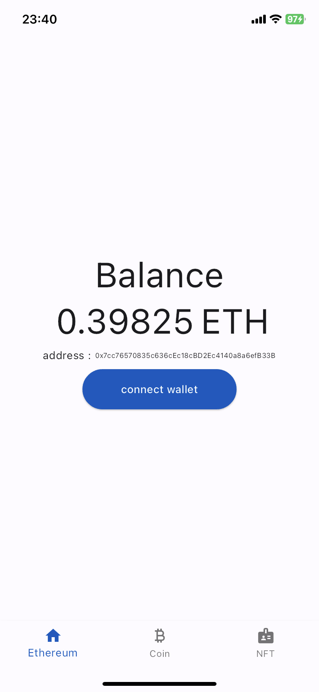
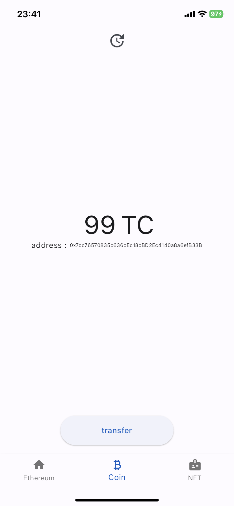
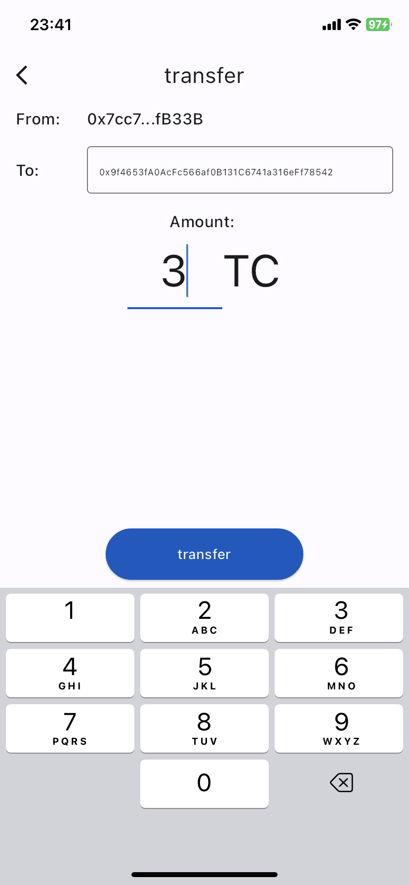
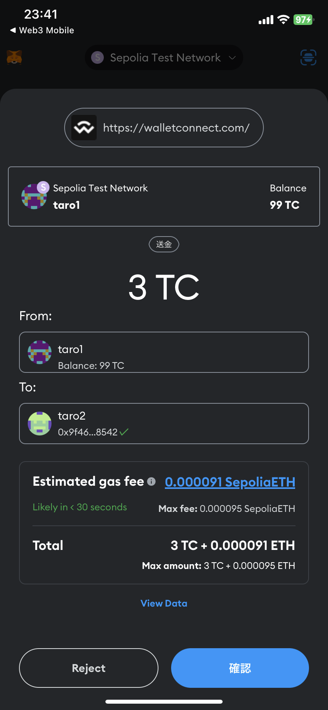

# web3-mobile
Sample web3 application(Dapp) using Flutter framwwork.  
* use WalletConnect for wallet connection.
* use only web3(ethereum) backend (without web2 servers).
## Ethereum tab
* connect to wallet with WalletConnect and get balance.

　

## Coin tab
* connect to ERC-20 smart contract and get balance.
* transfer coins with sending transaction via wallet app.
(launch wallet app automatically and confirm transaction with wallet app.)

　　

## NFT tab
not implemented.

---

# setup
## Configuration for Ethereum, WalletConnect connection
Please override [sepolia_ethereum_config.dart](/lib/config/sepolia_ethereum_config.dart) with your configuration.  
Or you can add own configuration file and switch to it with DI([providers.dart](/lib/di/providers.dart)).

```dart
class SepoliaEthereumConfig implements EthereumConfig {
  @override
  String get ethereumRpcUrl => 'https://eth-sepolia.g.alchemy.com/v2/xxx'; //endpoint for coin contract. (ex: alchemy endpoint).

  @override
  String get coinContractAddress => '0x....'; //deployed coin contract address.

  //wallet connect configurations.
  @override
  String get walletConnectProjectId => 'abc...';
  @override
  String get walletConnectChainId => 'eip155:11155111';
  @override
  String get walletConnectParingMetadataName => 'Sample Dapp';
  @override
  String get walletConnectParingMetadataDescription => 'Sample Dapp';
  @override
  String get walletConnectParingMetadataUrl => 'https://walletconnect.com/';
  @override
  String get walletConnectParingMetadataIconUrl => 'https://i.imgur.com/sVny9Yi.png';
  @override
  String get walletConnectParingMetadataRedirectAppSchema => 'sampledapp://';
}

```

---

# usage
## connect wallet 
* press "connect wallet" button and jump to wallet app.
* confirm connection with wallet app and redirect to this app automatically.
## transfer ERC-20 coin
* press "transfer" button and input amount to transfer.
* wallet app is launched automatically and confirm transaction. 
